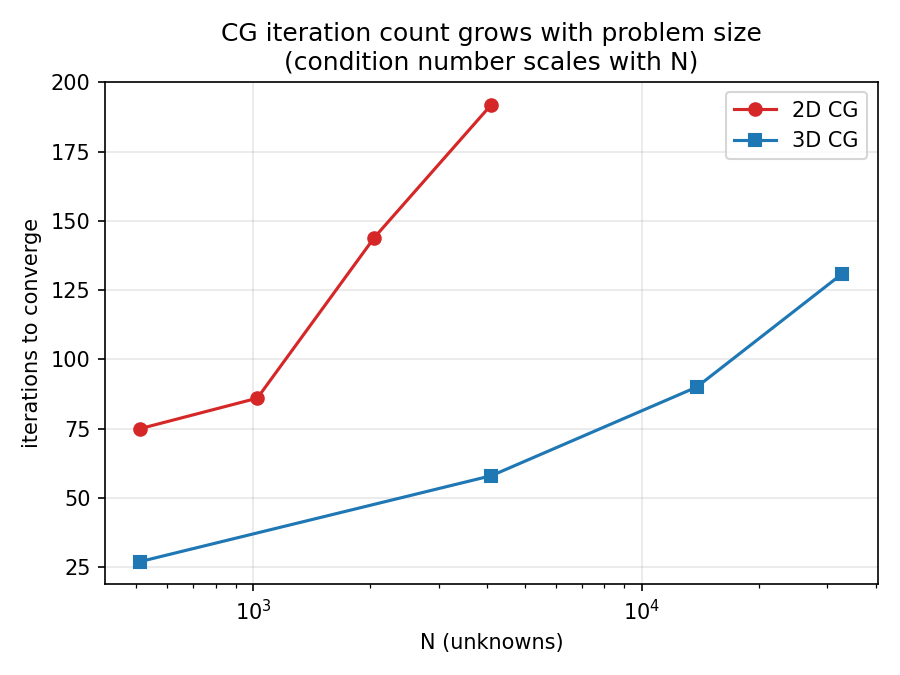
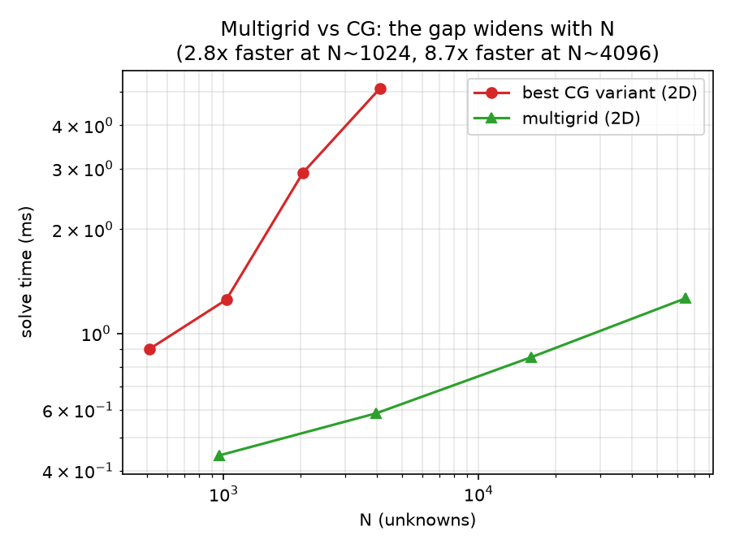
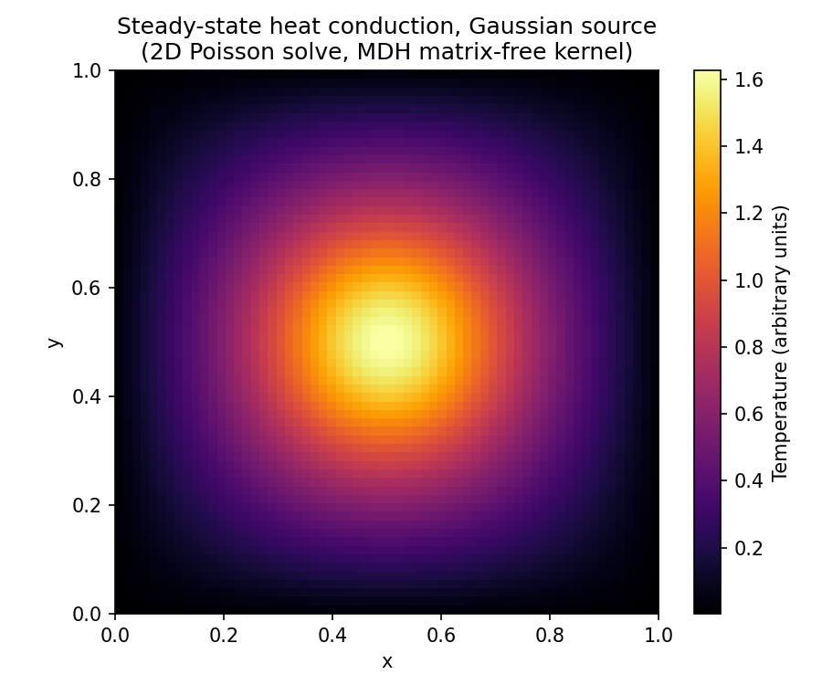
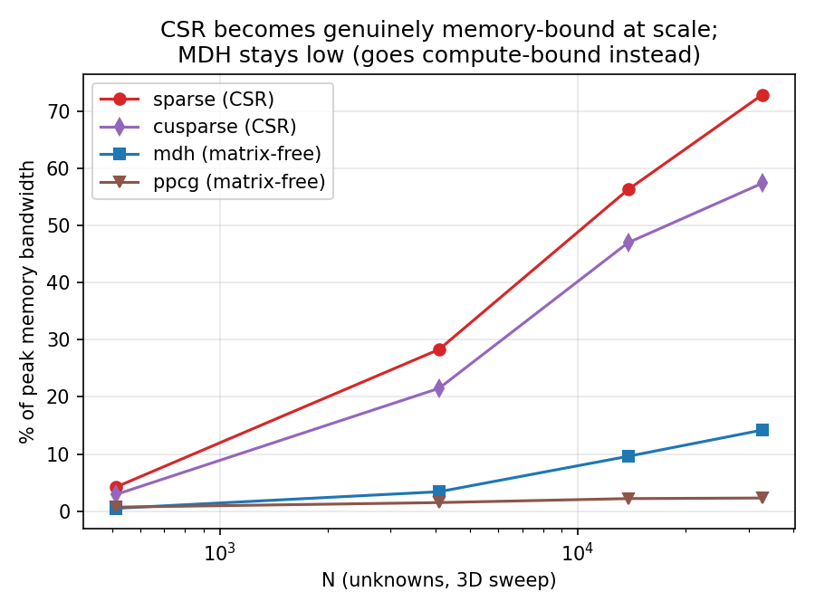
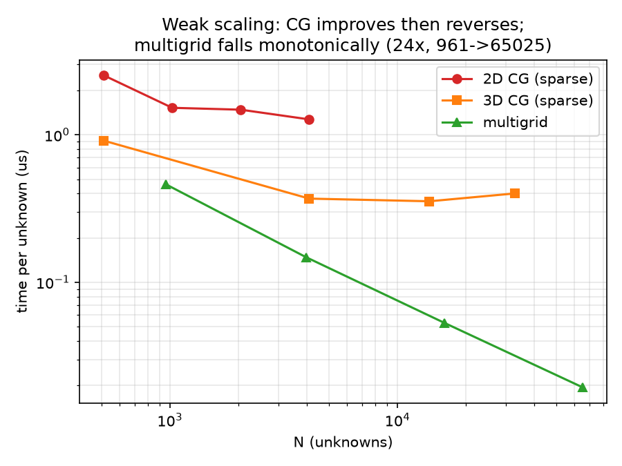

# mdh-poisson-solvers

Matrix-free and CSR Poisson solvers on GPU, comparing four ways of producing the same GPU kernel: a hand-written baseline, MDH's auto-tuned code generation, PPCG's polyhedral code generation, and NVIDIA's own vendor libraries (cuSPARSE and cuBLAS). Covers the Conjugate Gradient method and geometric multigrid, in both 2D and 3D, plus preconditioning, a real physical application, and detailed GPU profiling.

> **Update for the revised paper (October 2026).** Sections 1 to 8 below were measured on one GPU (RTX 3050 Laptop) with MDH in a fixed, untuned
> configuration and PPCG in its default schedule. The revision added experiments in [`handtuned_baseline/`](handtuned_baseline/README.md),
> `ppcg_tuning/` and `mdh_specs/` (second GPU: RTX 5090; hand-tuned baseline; PPCG with tuned tile/block sizes; fully MDH-generated CG) that qualify several statements below:
> 1. With PPCG's tile and block sizes tuned, PPCG is as fast as tuned MDH (0.83 to 1.02 times its run time on both GPUs); the "up to 8x" below is a comparison with PPCG's **default** schedule.
> 2. Tuned MDH is within 0.91 to 1.12 times of a hand-tuned matrix-free kernel on both GPUs.
> 3. The "compute-bound" statement for the matrix-free kernel does not hold for the tuned kernel (31% of SM throughput, below 18% of the bandwidth peak): at these sizes the matrix-free kernels are launch- and latency-limited. The bandwidth percentages below use Nsight's sustained peak (about 171 GB/s); against the 192 GB/s theoretical peak, CSR reaches 59% (not 73%) at the largest size.
> 4. At large sizes on the RTX 5090, CSR and matrix-free kernels are both bandwidth-bound and the matrix-free speedup equals the ratio of bytes moved (6.5 in 2D, 8.5 in 3D for the matrix-vector product).
> Affected passages are marked *(see update)*.

Everything here solves the same underlying problem: the Poisson equation on a regular grid, discretized with a standard finite-difference stencil. What differs across the sections below is how the resulting sparse linear algebra gets turned into a GPU kernel, and how much that choice actually matters.

## What MDH is, for anyone who hasn't run into it before

MDH stands for Multi-Dimensional Homomorphisms. It's a way of describing a computation over a multi-dimensional array (a matrix, a grid, a tensor) as a formal specification, rather than as hand-written CUDA. You describe what the computation does dimension by dimension (a matrix-vector product, a stencil, a reduction) and an auto-tuning generator produces the actual GPU kernel: it picks tile sizes, thread block shapes, and memory layout automatically by searching a space of configurations and measuring which one runs fastest on the real hardware.

The pitch is correctness-by-construction (the generated kernel is guaranteed to compute the same thing the specification says, regardless of which tuning configuration gets picked) combined with performance portability (the same specification can be retuned for a different GPU without being rewritten by hand).

PPCG is a different kind of code generator. It takes plain sequential C code, and instead of searching a tuning space empirically, it analyzes the loop nest's structure mathematically (polyhedral compilation) and derives a parallel schedule in one shot, no search involved. It's a useful point of comparison specifically because it represents the opposite philosophy: static analysis instead of empirical search.

Both of these sit alongside a hand-written CUDA baseline (what a person would write directly) and NVIDIA's own vendor libraries (cuSPARSE for sparse linear algebra, cuBLAS for dense linear algebra), which represent the practical alternative of just using an existing, professionally maintained library instead of generating anything at all.

The question this whole project investigates: for a memory-bound stencil operator like the discrete Poisson equation, how much does the code-generation strategy actually matter, and where do the four approaches actually diverge?

## Repository structure

| Folder | What it is |
|---|---|
| `1_sparse_rewrite/` | Hand-written CSR (compressed sparse row) CG solver, the baseline |
| `2_mdh_sparse/` | MDH-generated matrix-free CG solver, plus the generator specification that produced it |
| `3_ppcg/` | PPCG-generated matrix-free CG solver, plus the plain C source fed to the polyhedral compiler |
| `4_cusparse/` | cuSPARSE-based CG solver, true CSR storage via the vendor library |
| `5_3d_extension/` | All four of the above extended to 3D, swept across four grid sizes |
| `6_multigrid/` | A hand-written geometric multigrid solver, benchmarked against every CG variant |
| `7_preconditioning/` | Jacobi and ILU(0) preconditioned CG, tested against plain CG |
| `8_real_application/` | A real physical scenario (heat conduction with a localized source) solved and cross-verified |
| `handtuned_baseline/`, `ppcg_tuning/`, `mdh_specs/` | Experiments of the revision: hand-tuned matrix-free baseline, PPCG with tuned tile/block sizes, second GPU (RTX 5090), GPU-resident and fully MDH-generated CG; see [`handtuned_baseline/README.md`](handtuned_baseline/README.md) |
| `tables/` | Three 2D comparison tables swept across sizes: matrix-vector product, full CG solve, and dense matrix multiply |
| `roofline/` | Nsight Compute profiling: measured memory bandwidth, compute throughput, and GPU occupancy |
| `scaling_analysis/` | Strong and weak scaling analysis built from the data above |
| `figures/` | Rendered plots of the size-sweep results |

Each numbered folder is a self-contained, independently buildable solver for the same 2D Poisson problem (a rectangular plate, Dirichlet boundary conditions, an analytical solution used to verify correctness). The problem is `-Laplacian(u) = f` on the unit square, discretized with a second-order finite difference scheme, which produces a sparse, symmetric, positive-definite linear system with a five-point stencil structure (seven-point in 3D). This is a standard model problem: it shows up directly in steady-state heat conduction, and the same operator structure appears in a huge range of other physics simulations.

## Correctness methodology

Every number in every table here comes from a kernel that was checked against an independent reference before it was ever timed. Two different methods were used depending on whether a closed-form answer exists:

- **Where an analytical solution exists** (the verification problem, `u(x,y) = 1 + x^2 + y^2`, chosen because it has a simple known closed form): every solver's final answer is compared directly against that formula. Agreement within 1e-6 to 1e-5 is the expected signature of correct floating-point code; a real bug (wrong neighbor offset, wrong coefficient, an off-by-one at a boundary) produces errors many orders of magnitude larger, because it changes the shape of the computation, not just its rounding.
- **Where no closed-form solution exists** (the real-world heat conduction application in section 8, which uses a physically realistic source term instead of a polynomial chosen for convenience): two independently implemented solvers are run on the same problem and checked for agreement instead. This is the standard approach in numerical work when no analytical answer is available.

Every GPU kernel, at every problem size, in every section below, passed this check before its timing numbers were trusted.

## Requirements

- An NVIDIA GPU. The numbers in sections 1 to 8 of this repository were measured on an RTX 3050 Laptop GPU (4GB, compute capability 8.6); the experiments of `handtuned_baseline/` were measured on that GPU and on an RTX 5090 (CUDA 12.9, compute capability 12.0).
- CUDA Toolkit with `nvcc` on your PATH. Developed and tested against CUDA 11.7.
- `cusparse` (ships with the CUDA toolkit) for the cuSPARSE-based solvers and the preconditioning section.
- Python 3 with matplotlib, only needed to regenerate the figures in `figures/` and `8_real_application/`.
- Nsight Compute (`ncu`), only needed to regenerate the profiling data in `roofline/`. Needs root access to read GPU performance counters.

## Building

Every solver file has its exact `nvcc` build command in a comment at the top of the file. A few things worth knowing before you start:

**The MDH and PPCG kernels are auto-generated, and the generated output is not checked into this repository.** Committing multi-megabyte machine-generated source doesn't help anyone read the project, so what's here instead is the hand-written input each generator actually needs: the MDH specification files (`spec/*.cpp`) and the plain C source PPCG compiles (`*_ppcg_src.c`). To build the MDH or PPCG solvers yourself, you need the corresponding generator toolchain (the MDH code generator, or the PPCG polyhedral compiler, tag `ppcg-0.08.3`) to turn those specification files into actual `.cu` kernels first. The hand-written CSR and cuSPARSE solvers (folders `1_sparse_rewrite/` and `4_cusparse/`) have no such dependency and build directly with a single `nvcc` call.

Each table and sweep folder has a `build_and_run_sweep*.sh` script that builds and runs everything for that section in one go, assuming the generated kernels for that size already exist alongside the hand-written source (matching how the size-specific PPCG source and generated kernel are laid out per folder).

## Results

### 1. Isolated matrix-vector product, 2D, swept across sizes

`Ap = A*p`, the operation that dominates every CG iteration. Timed in isolation with `cudaEvent`, 20 warmup launches plus 200 timed launches, averaged. Non-square grids used for the two sizes that aren't perfect squares (512 = 16x32, 2048 = 32x64).

| size (grid) | sparse (ms) | mdh (ms) | ppcg (ms) | cusparse (ms) | correct |
|---|---:|---:|---:|---:|:---:|
| 512 (16x32) | 0.00239 | 0.00186 | 0.00178 | 0.00697 | yes |
| 1024 (32x32) | 0.00228 | 0.00168 | 0.00176 | 0.00671 | yes |
| 2048 (32x64) | 0.00230 | 0.00176 | 0.00180 | 0.00688 | yes |
| 4096 (64x64) | 0.00240 | 0.00180 | 0.00183 | 0.00717 | yes |

MDH is fastest or tied-fastest at every size, PPCG close behind, the hand-written CSR kernel third, cuSPARSE consistently three to four times slower. Timings barely move across this size range because these are all still small problems for a GPU (a few thousand threads of actual work at most), so kernel launch and dispatch overhead dominates over compute regardless of size. cuSPARSE's fixed per-call overhead shows up as a roughly constant penalty here rather than shrinking as a fraction of total time, the way it would at a genuinely large problem (see the roofline section below for that crossover measured directly). *(see update: MDH here uses a fixed, untuned configuration and PPCG its default schedule; with tuned configurations the two are tied.)*

MDH's generated kernel needed zero regeneration across sizes: the same compiled kernel is just recompiled with different tile-size macros. PPCG's kernel had to be regenerated per size, since it bakes array strides in as literal constants.

### 2. Full CG solve to convergence, 2D, swept across sizes

Same four matvec kernels, dropped into an identical host-side CG loop (dot products, vector updates, `cudaMemcpy` per iteration). 10 runs per method and size, first dropped as warmup, remaining 9 averaged.

| size | sparse (ms) | mdh (ms) | ppcg (ms) | cusparse (ms) | iterations |
|---|---:|---:|---:|---:|---:|
| 512 | 1.2474 | 1.2138 | 1.1617 | 1.3678 | 75 |
| 1024 | 1.5293 | 1.5082 | 1.5240 | 1.6491 | 86 (87 for ppcg) |
| 2048 | 2.9023 | 3.0074 | 2.9818 | 3.2083 | 144 |
| 4096 | 4.9836 | 5.0590 | 5.0804 | 5.3237 | 192 |

All 16 runs converge to the same final answer within float32 rounding precision, confirming every combination of method and size computes the correct operator. PPCG needing one extra iteration at N=1024 is a real, reproducible artifact of floating-point summation order (it adds the stencil terms in a different order than the other three kernels), not a bug: the final answer still agrees with everyone else's to within 1e-6.

The gap between methods is much narrower here than in the isolated matvec table. At these sizes, host-side CPU reductions and the memory copy round trip per iteration dominate total time, so which matvec kernel is used matters less once it's folded into the full solver loop. This same pattern shows up again, more dramatically, in the 3D results below.

### 3. Dense matrix multiplication, 2D, swept across sizes

CG itself never performs a dense matrix-matrix multiply. This table exists for completeness, comparing the two code generators against the correct dense vendor baseline (cuBLAS, not cuSPARSE, since this is a dense operation). 5 timed launches averaged after warmup.

| size | naive (ms) | mdh (ms) | ppcg (ms) | cublas (ms) |
|---|---:|---:|---:|---:|
| 512 | 0.624 | 0.823 | 2.271 | 0.077 |
| 1024 | 4.928 | 6.466 | 41.973 | 0.442 |
| 2048 | 37.763 | 46.071 | 69.288 | 3.388 |
| 4096 | 283.820 | 369.788 | 435.918 | 29.299 |

A very different story from the matvec and CG tables. cuBLAS wins by roughly 10 to 15 times over the best non-vendor method at every size, which is expected: cuBLAS is a mature, heavily hand and auto-tuned vendor kernel, likely using tensor-core or otherwise specialized code paths this GPU supports. More interesting is that a plain, untiled naive kernel beats both generators at every size tested here. This isn't evidence that code generation doesn't work: both MDH and PPCG are running an untuned first-guess tile configuration in this table, not a searched or hand-tuned one. Separate tuning work on this exact kernel shape (not included in this sweep) found a configuration where MDH ran roughly 2.4 times faster than PPCG at N=2048, so there is real headroom this particular run doesn't capture.

### 4. The 3D extension

Direct extension of sections 1 through 4 into three dimensions: same four methods, same verification approach, now solving `-Laplacian(u) = f` on the unit cube with a seven-point stencil. This required writing the first three-dimensional specification ever built for the MDH generator used here (previously only two-dimensional stencils had been expressed in it), and it worked without any change to the generator itself: the same template that handles an arbitrary number of dimensions accepted a third dimension immediately, and a three-level-nested neighborhood pattern was all that was needed to describe the seven-point stencil. The new kernel was checked element-wise against a plain CPU reference at a tiny 4x4x4 grid before being trusted at real problem sizes, exactly the same discipline used everywhere else in this project.

**Isolated matvec, 3D, swept across sizes:**

| size (grid) | sparse (ms) | mdh (ms) | ppcg (ms) | cusparse (ms) | correct |
|---|---:|---:|---:|---:|:---:|
| 512 (8^3) | 0.00240 | 0.00175 | 0.00185 | 0.00580 | yes |
| 4096 (16^3) | 0.00234 | 0.00185 | 0.00391 | 0.00651 | yes |
| 13824 (24^3) | 0.00358 | 0.00231 | 0.00817 | 0.00844 | yes |
| 32768 (32^3) | 0.01412 | 0.00329 | 0.02617 | 0.01771 | yes |

MDH wins at every size, and its margin over PPCG widens sharply as the grid grows, from roughly tied at the smallest size to about eight times faster at the largest. This is a real, measured difference between the two default configurations *(see update: with PPCG's tile and block sizes tuned the gap disappears)*: PPCG's auto-generated 3D schedule runs as a single thread block on a single streaming multiprocessor at every size tested (confirmed both from the launch configuration itself and independently from GPU occupancy profiling, see below), fully parallelizing only one of the three dimensions and leaving the GPU's other streaming multiprocessors completely idle regardless of how large the problem gets. MDH's schedule adds more thread blocks as the grid grows, so it keeps engaging more of the GPU. This is PPCG's unmodified default schedule (no manual tuning flags were used anywhere in this project for either generator), so it's a genuine data point about how the two generation strategies diverge in 3D, not a methodology error.

**Full CG solve, 3D, swept across sizes:**

| size | sparse (ms) | mdh (ms) | ppcg (ms) | cusparse (ms) | iterations |
|---|---:|---:|---:|---:|---:|
| 512 (8^3) | 0.4622 | 0.4646 | 0.4704 | 0.5331 | 27 |
| 4096 (16^3) | 1.4662 | 1.4984 | 1.6673 | 1.6478 | 56-62 |
| 13824 (24^3) | 4.6749 | 4.9399 | 5.2396 | 5.4943 | 84-93 |
| 32768 (32^3) | 13.2364 | 12.6460 | 16.7041 | 13.7694 | 130-132 |

All four converge to the correct answer at every size. The gap between methods is much narrower here than in the isolated matvec table, the same pattern seen in 2D: host-side overhead dominates the full solve at these sizes, so the isolated kernel gap of up to eight times mostly washes out once folded into the full solver loop. PPCG's per-iteration matvec disadvantage still shows up as a consistent 15 to 25 percent slower full solve at every size, though.

### 5. Geometric multigrid, compared against CG

CG is not the only way to solve this kind of problem, and it's worth knowing how it actually compares to a purpose-built alternative rather than only comparing it to other CG implementations. A hand-written geometric multigrid solver was built for the same 2D problem: a standard V-cycle, damped weighted Jacobi smoothing, full-weighting restriction, bilinear prolongation, and an exact closed-form solve at the coarsest grid level.

Multigrid needs its own properly scaled discrete operator at every grid level (unlike the CG solvers here, which fold the grid spacing into the right-hand side once and use an unscaled stencil everywhere), and it needs a grid family of the form `m = 2^k - 1` rather than a plain power of two, so that each coarser level's boundary distance stays consistent with its own grid spacing. Getting this wrong is a real, easy-to-make mistake: an early attempt at a simpler grid alignment converged fine with two grid levels but diverged outright once a third coarsening level was added, traced to exactly this boundary-consistency issue. Every part of the corrected solver (the smoother, the residual computation, the restriction and prolongation operators) was checked element-wise against a CPU reference before being trusted, and the full V-cycle was independently verified against both a CPU reference implementation and the known analytical solution.

**Multigrid alone, swept across sizes:**

| size | avg ms (9-run) | V-cycles | max error vs analytical |
|---|---:|---:|---:|
| 961 (31^2) | 0.4570 | 6 | 9.97e-05 |
| 3969 (63^2) | 0.5839 | 6 | 1.03e-04 |
| 16129 (127^2) | 0.8281 | 6 | 1.09e-04 |
| 65025 (255^2) | 1.2780 | 6 | 1.30e-04 |

The V-cycle count is exactly 6 at every size tested, across an 8x range in grid side length and a 68x range in total unknowns. This is the textbook multigrid property that makes the comparison below worth having: unlike CG, whose iteration count grows as the grid gets larger (because the condition number of the underlying matrix grows with it), multigrid's convergence rate is asymptotically independent of grid size.

CG's iteration count climbing with N is not a small effect. In 2D it goes from 75 iterations at N=512 up to 192 at N=4096; in 3D, from 27 at N=512 up to 131 at N=32768. Multigrid's line, by contrast, would be flat at 6 across this entire plot at any scale, which is exactly the property the next table puts a number on.

**Multigrid against every CG variant, matching problem sizes:**

| N (approx) | sparse | mdh | ppcg | cusparse | multigrid |
|---|---:|---:|---:|---:|---:|
| ~1024 | 1.5293 ms | 1.5082 ms | 1.5240 ms | 1.6491 ms | 0.4570 ms |
| ~4096 | 4.9836 ms | 5.0590 ms | 5.0804 ms | 5.3237 ms | 0.5839 ms |

Multigrid beats every CG variant at both sizes, and the margin grows sharply with N: 3.3 times faster than the best CG variant at N around 1024, widening to 8.5 times faster at N around 4096. The mechanism is exactly the iteration-count story above: CG's iteration count climbs from 75 to 192 across the full 2D sweep in section 2, while multigrid's stays flat at 6, so the performance gap between the two approaches is not a fixed constant, it widens indefinitely as the problem gets larger. This result is why comparing CG's code-generation strategies to each other only tells part of the story: the choice of algorithm matters more than the choice of code generator once the problem is large enough.

Both axes here are log-scaled, so the widening vertical gap between the two lines as N increases is a real, growing ratio, not a plotting artifact. Multigrid starts out a few times faster and ends up close to an order of magnitude faster, with no sign of the two lines converging.

### 6. Preconditioning

Preconditioning is a standard technique for speeding up CG's convergence by transforming the linear system into one with a more favorable condition number. Two methods were implemented and tested against plain CG: a Jacobi (diagonal) preconditioner, and an incomplete LU factorization with no fill-in, ILU(0), using cuSPARSE's factorization and generic sparse triangular solve routines.

| N | plain CG (ms) | Jacobi PCG (ms) | ILU(0) PCG (ms) | plain iters | Jacobi iters | ILU(0) iters |
|---|---:|---:|---:|---:|---:|---:|
| 256 | 0.7833 | 0.7884 | 1.5307 | 43 | 43 | 17 |
| 1024 | 1.6656 | 1.7009 | 4.7641 | 86 | 86 | 30 |
| 4096 | 5.3678 | 5.5313 | 22.3424 | 192 | 192 | 56 |
| 16384 | 26.5364 | 29.8967 | 121.8384 | 406 | 406 | 109 |

**Jacobi preconditioning turns out to be exactly inert for this problem, confirmed rather than assumed.** The iteration count matches plain CG precisely at every single size (43/43, 86/86, 192/192, 406/406, not merely close). This is expected once you look at the operator: the discrete Poisson stencil has a constant diagonal (every interior grid point has the same diagonal coefficient), so a diagonal preconditioner is just a uniform scalar multiple of the identity matrix, which is algebraically inert for CG: the scaling cancels out in the step-size calculations. It was worth building and measuring anyway rather than assuming it, and the numbers back the prediction exactly.

**ILU(0) reduces iteration count substantially, and the benefit grows with problem size:** from 2.5 times fewer iterations at N=256 up to 3.7 times fewer at N=16384. But it is consistently slower in wall-clock time at every size tested, and that slowdown also grows with N rather than shrinking, from about 2 times slower at N=256 to about 4.6 times slower at N=16384. The reason is the per-iteration cost: ILU(0) needs two sparse triangular solves per iteration (one forward, one backward) on top of the usual matrix-vector product, and sparse triangular solves are inherently much less parallel on a GPU than a matrix-vector product, since later results depend on earlier ones within the same solve. At N=4096, each ILU(0) iteration costs roughly 15 times more than a plain CG iteration. The convergence benefit is real; on this hardware, for this problem size range, it doesn't translate into a wall-clock win.

### 7. A real physical application

The Poisson equation is usually introduced by way of physical examples like steady-state heat conduction, but everything up to this point in this project uses a synthetic problem chosen specifically because it has a known closed-form answer to check against. This section solves an actual physical scenario instead: steady-state heat conduction on a plate with a localized heat source at the center (a Gaussian source function, representing something like an embedded heating element) and the plate's frame held at a fixed reference temperature.

A Gaussian source has no closed-form Poisson solution on a bounded square, which is normal: this is exactly why numerical methods exist for real problems. So instead of comparing against a formula, the same scenario was solved independently by two solvers already built and verified elsewhere in this project (the hand-written CSR solver and the MDH matrix-free solver), and checked for agreement, which is the standard verification approach when no analytical answer exists.

| | CSR | MDH |
|---|---:|---:|
| Iterations to converge | 99 | 99 |
| Peak temperature | 1.6257 | 1.6257 |
| Peak location (grid) | (31,31) | (31,31) |
| Minimum temperature | 0.0016 | 0.0016 |

The two independently computed solutions agree to a maximum absolute difference of 2.0e-06, the same float32 rounding-level agreement seen in every other cross-method check in this project. Both solvers land on the identical iteration count, identical peak temperature, and identical peak location. The peak temperature sits at physical coordinates (0.492, 0.508), essentially exactly the source's actual center at (0.5, 0.5), and the minimum temperature sits near the imposed boundary value, both signs that the numerical result matches the physics it's supposed to represent, not just an internally consistent but wrong answer.

The bright core is the heat source at the plate's center, cooling outward in smooth concentric rings until it reaches the dark, cold frame at the edges. This is a clean, radially symmetric hot spot with no artifacts or asymmetry, exactly the shape a localized heat source with a cooled boundary should produce. The plotted field is the CSR and MDH solutions averaged together; the two agree closely enough that either one alone would look identical.

What this section actually establishes for the rest of the project: every other result here, including every speed comparison, was measured on the synthetic verification problem, chosen because it has a known closed-form answer that makes checking correctness easy. That's a convenient test case, but it isn't proof the MDH-generated kernel works on anything else. This section is that proof. The same generated kernel, unchanged, fed a genuinely different right-hand side with no algebraic shortcut behind it, and it produced the correct physical answer, independently confirmed by a second solver. The speed numbers earlier in this README are only worth trusting because the kernel producing them is shown here to be solving the real equation, not something tuned to pass one specific test.

### 8. Measured GPU roofline: memory bandwidth and compute throughput

Timing numbers alone don't say why a kernel is fast or slow. Nsight Compute was used to directly measure achieved memory bandwidth and achieved compute throughput for every matvec kernel, rather than relying on a theoretical estimate of where the bottleneck should be.

**2D, N=4096, one steady-state kernel launch per method:**

| method | kernel duration | DRAM bytes moved | achieved bandwidth | % of peak bandwidth | % of peak compute |
|---|---:|---:|---:|---:|---:|
| sparse (CSR) | 4.83 us | 194.69 KB | 40.29 GB/s | 25.3% | 4.9% |
| mdh (matrix-free) | 2.88 us | 16.51 KB | 5.73 GB/s | 3.8% | 6.2% |
| ppcg (matrix-free) | 3.26 us | 17.66 KB | 5.41 GB/s | 3.7% | 2.9% |
| cusparse (CSR) | 6.94 us | 197.38 KB | 28.42 GB/s | 17.6% | 10.6% |

Two things worth taking seriously here. First, matrix-free genuinely moves about 11 to 12 times less memory traffic than CSR, measured directly rather than estimated: the CSR methods have to load both a value and an integer column index for every nonzero entry, while the matrix-free kernels compute neighbor indices arithmetically from grid coordinates and never touch that indirect data at all. Second, none of these kernels are anywhere close to saturating either the memory bandwidth or the compute roofline at this problem size. The highest achieved is the CSR kernel at about a quarter of peak bandwidth; the matrix-free kernels sit under 4 percent. At N=4096, none of these kernels are actually bandwidth-bound or compute-bound in any practical sense: they're bound by kernel launch and dispatch overhead instead, since the actual amount of work per launch is still tiny for a modern GPU.

**3D, swept across sizes, percent of peak memory bandwidth:**

| N | sparse (CSR) | cusparse (CSR) | mdh (matrix-free) | ppcg (matrix-free) |
|---|---:|---:|---:|---:|
| 512 | 4.2% | 2.9% | 0.5% | 0.7% |
| 4096 | 28.3% | 21.5% | 3.4% | 1.5% |
| 13824 | 56.3% | 47.0% | 9.6% | 2.2% |
| 32768 | 72.9% | 57.4% | 14.2% | 2.3% |

This is where the overhead-bound story from the 2D pass resolves into a much clearer picture. The CSR-based methods really do become genuinely memory-bandwidth-bound as the problem grows: sparse climbs from 4.2 to 72.9 percent of Nsight's sustained peak bandwidth (59 percent of the 192 GB/s theoretical peak), a steady, near-linear climb toward saturation, and cuSPARSE follows the same shape. At the largest size tested, the sparse kernel is genuinely close to the memory bandwidth ceiling. The matrix-free MDH kernel does not follow the same path: its bandwidth usage climbs too, but stays far below the CSR methods throughout, while its compute throughput climbs much faster instead, reaching 40 percent of peak compute at the largest size (the single highest compute utilization of any method at any size measured). This is a genuinely different performance regime, not just a faster version of the CSR story: matrix-free recomputes stencil coefficients and neighbor offsets arithmetically instead of reading them from memory, so the profile with the untuned configuration looked increasingly compute-bound. *(see update: the tuned kernel reaches 31 percent and the hand-tuned kernel 20 percent of SM throughput, both below 18 percent of the bandwidth peak, so at these sizes the matrix-free kernels are launch- and latency-limited, not compute-bound.)* PPCG stays flat and low at every size, consistent with the single-SM occupancy limitation described below: it never becomes either memory-bound or compute-bound, because it never engages enough of the GPU to become bound by anything except its own underutilization.

The two CSR lines climb steadily toward the top of the chart as N grows, which is what genuinely becoming memory-bound looks like on a plot. MDH's line climbs too, but stays well underneath both CSR lines the whole way, because the memory traffic it would need to saturate bandwidth with just isn't there: it's spending its growing resource budget on compute instead, not on memory transfers. PPCG barely moves off the bottom of the chart at any size.

### 9. GPU occupancy

Occupancy measures how much of the GPU's available parallel execution capacity a kernel actually uses, which turns out to explain a lot of the pattern above. Every kernel measured here reports 100 percent theoretical occupancy at every size: none of them are limited by register usage or shared memory per thread. The entire story is in achieved occupancy, which is a question of how many thread blocks the launch configuration actually creates relative to the GPU's streaming multiprocessor count, not a per-kernel resource-usage question.

**3D, swept across sizes, percent achieved occupancy:**

| N | sparse | mdh | ppcg | cusparse |
|---|---:|---:|---:|---:|
| 512 | 15.6% | 33.1% | 7.9% | 16.3% |
| 4096 | 16.2% | 33.1% | 16.0% | 16.5% |
| 13824 | 54.5% | 54.8% | 24.3% | 45.7% |
| 32768 | 82.2% | 83.4% | 33.1% | 85.0% |

Sparse, MDH, and cuSPARSE all climb toward using most of the GPU's available parallelism as the problem grows, the expected, healthy pattern: more available work lets a fixed device get used more fully. PPCG's number also climbs with N, and at a glance looks like the same story, but it isn't. PPCG's launch configuration at every size tested is a single thread block, full stop; its rising occupancy number is purely a side effect of that one block's thread count growing larger as the problem grows, not more of the GPU being engaged. This was checked directly: predicting PPCG's occupancy purely from its block size (with no assumption about how many streaming multiprocessors are in use) matches the measured numbers almost exactly at every size, which confirms mechanically that PPCG uses at most one of this GPU's sixteen streaming multiprocessors, regardless of problem size. *(see update: this is a property of PPCG's default schedule; with tuned tile and block sizes PPCG launches several blocks and matches tuned MDH.)*

**Multigrid, 2D, swept across sizes:**

| N | achieved occupancy |
|---|---:|
| 961 | 16.5% |
| 3969 | 16.5% |
| 16129 | 59.0% |
| 65025 | 76.0% |

Multigrid follows the same healthy scaling pattern as sparse, MDH, and cuSPARSE, climbing toward substantial GPU utilization as the problem grows: further confirmation that its speed advantage over CG isn't coming from cutting corners on hardware usage, it genuinely uses the GPU well while doing dramatically less total work.

### 10. Scaling analysis

The classical definitions of strong and weak scaling are about varying the number of processors: a fixed problem size spread across more processors (strong scaling), or a problem size that grows in proportion to the number of processors (weak scaling). This project runs on a single GPU, so there's no processor count to vary in that literal sense. The two questions get reinterpreted here in a way that still means something for a fixed device: weak scaling becomes "does the cost per unit of work stay constant as the problem grows," and strong scaling becomes "how fully does the implementation use the device's fixed parallel resources as more work becomes available."

**Weak scaling, time per unknown in microseconds, lower and flatter is better:**

| N | 2D CG (sparse) | 3D CG (sparse) | multigrid |
|---|---:|---:|---:|
| 512 / 961 | 2.436 | 0.903 | 0.4755 |
| 1024 / 3969 | 1.494 | - | 0.1471 |
| 2048 / 4096 | 1.417 | 0.358 | - |
| 4096 / 13824 | 1.217 | 0.338 | - |
| 32768 / 16129 | - | 0.404 | 0.0513 |
| 65025 | - | - | 0.0197 |

(Rows are approximately matched by scale across the three series, not by identical N, since the CG and multigrid grid families don't land on the same exact sizes; see `scaling_analysis/results.md` for the exact per-series tables.)

CG's per-unit cost does not scale ideally: it drops sharply at first as fixed per-iteration overhead gets amortized over more work, but then reverses and starts climbing again at the largest sizes tested, in both 2D and 3D. This is the direct, measured consequence of CG's iteration count growing with N. Multigrid's per-unit cost falls monotonically and dramatically instead, becoming 24 times more efficient per unknown at its largest tested size than at its smallest, with no reversal anywhere in the range tested: close to ideal weak scaling, because the V-cycle count stays flat regardless of problem size.

Both CG lines (2D and 3D) dip and then visibly turn back upward toward the right side of the chart, the reversal described above happening in real time as N grows. The multigrid line just keeps going down, in a straight line on this log-log plot, all the way to the largest size tested. That straight downward line is what "close to ideal weak scaling" actually looks like.

**Strong scaling, reinterpreted as GPU utilization versus problem size:** covered directly by the occupancy tables in section 9 above. Sparse, MDH, cuSPARSE, and multigrid all scale toward using most of the GPU as the problem grows. PPCG is the one method in this entire project that does not, structurally capped at a single streaming multiprocessor no matter how much work is available.

### 11. What changes once the matrix gets stored densely instead of matrix-free

An earlier trial (old_trial, dense storage) measured MDH against PPCG using a dense matrix representation instead of the matrix-free stencil approach used everywhere else in this repository, and found a speedup that grew steadily with problem size, from about 17 percent at the smaller end up to about 121 percent at the largest size tested:

| N | MDH (ms) | PPCG (ms) | PPCG slower by |
|---|---:|---:|---:|
| 512 | 1.149 | 1.471 | 28.0% (1.28x) |
| 1024 | 2.154 | 2.528 | 17.4% (1.17x) |
| 2048 | 2.739 | 4.067 | 48.5% (1.48x) |
| 4096 | 7.071 | 11.885 | 68.1% (1.68x) |
| 8192 | 24.502 | 54.199 | 121.2% (2.21x) |

The matrix-free rebuild in this repository does not reproduce that pattern at the full-solver level. Same comparison, MDH against PPCG, full CG solve, but matrix-free instead of dense:

**2D:**

| N | MDH (ms) | PPCG (ms) | PPCG slower by |
|---|---:|---:|---:|
| 512 | 1.2138 | 1.1617 | -4.3% (PPCG wins) |
| 1024 | 1.5082 | 1.5240 | 1.0% |
| 2048 | 3.0074 | 2.9818 | -0.9% (PPCG wins) |
| 4096 | 5.0590 | 5.0804 | 0.4% |

**3D:**

| N | MDH (ms) | PPCG (ms) | PPCG slower by |
|---|---:|---:|---:|
| 512 (8^3) | 0.4646 | 0.4704 | 1.2% |
| 4096 (16^3) | 1.4984 | 1.6673 | 11.3% |
| 13824 (24^3) | 4.9399 | 5.2396 | 6.1% |
| 32768 (32^3) | 12.6460 | 16.7041 | 32.1% |

Basically flat and noisy in 2D, with PPCG actually winning twice, and only modestly growing in 3D, nowhere near the old trial's 121 percent. The gap the old trial measured actually does exist in this matrix-free rebuild, but it lives somewhere else: in the isolated matvec kernel, before it gets folded into a full solve and diluted by host-side memory copies and CPU-side reductions every iteration.

**3D isolated matvec (`bench_matvec_3d.cu`):**

| N | MDH (ms) | PPCG (ms) | PPCG slower by |
|---|---:|---:|---:|
| 512 (8^3) | 0.00175 | 0.00185 | 5.7% |
| 4096 (16^3) | 0.00185 | 0.00391 | 111.4% |
| 13824 (24^3) | 0.00231 | 0.00817 | 253.7% |
| 32768 (32^3) | 0.00329 | 0.02617 | 695.4% |

At the kernel level, the gap is actually much larger than what the old dense-storage trial found, growing from 6 percent up to nearly 700 percent. Put plainly: the old trial's growing percentage was measured on dense-matrix kernels, in a regime where the matvec cost dominates the entire solve loop. This repository's matrix-free rebuild shows the same kind of growing gap at the kernel level, an even bigger swing than the old trial found. But once that kernel gets folded into the full iterative solve (the memory copy and CPU-side reduction every iteration), most of that advantage gets diluted, landing at a modest 32 percent at best in 3D and close to nothing in 2D. The old trial's headline number was really describing the isolated-kernel regime specifically; it just wasn't labeled that way at the time.

## Summary of what actually differs across the four approaches

- **Isolated kernel speed (matrix-free, both 2D and 3D):** MDH fastest or tied-fastest at every size measured, with the margin over PPCG widening sharply at larger 3D sizes (up to about 8x against PPCG's default schedule *(see update: tuned PPCG matches tuned MDH)*).
- **Full solver speed:** the gap between all four methods narrows sharply once folded into a full CG solve, because host-side overhead dominates at these sizes.
- **Memory traffic:** matrix-free genuinely moves about 11 to 12 times less data than CSR, measured directly with a profiler, not estimated.
- **Roofline regime at scale:** CSR-based methods become genuinely memory-bandwidth-bound as the problem grows (59% of the theoretical peak at the largest size on the RTX 3050). *(see update)* The matrix-free kernels, generated or hand-tuned, stay far below both ceilings at these small sizes (launch- and latency-limited); at large sizes on the RTX 5090 both representations are bandwidth-bound and the matrix-free speedup equals the ratio of bytes moved.
- **GPU utilization:** sparse, MDH, cuSPARSE, and multigrid all scale up to use most of the GPU as problem size grows. PPCG's generated 3D schedule is structurally capped at a single streaming multiprocessor regardless of problem size, confirmed three independent ways (timing, roofline, and occupancy) *(see update: this describes PPCG's default schedule only)*.
- **Algorithm choice matters more than code-generation choice at scale:** geometric multigrid beats every CG variant, by a margin that widens from 3.3x to 8.5x as the problem grows, because CG's iteration count grows with problem size and multigrid's does not.
- **Preconditioning:** a diagonal (Jacobi) preconditioner is provably and measurably useless for this specific operator. ILU(0) meaningfully reduces iteration count, but loses on wall-clock time on this GPU due to the cost of sparse triangular solves, and that loss grows with problem size even as the iteration-count benefit also grows.
